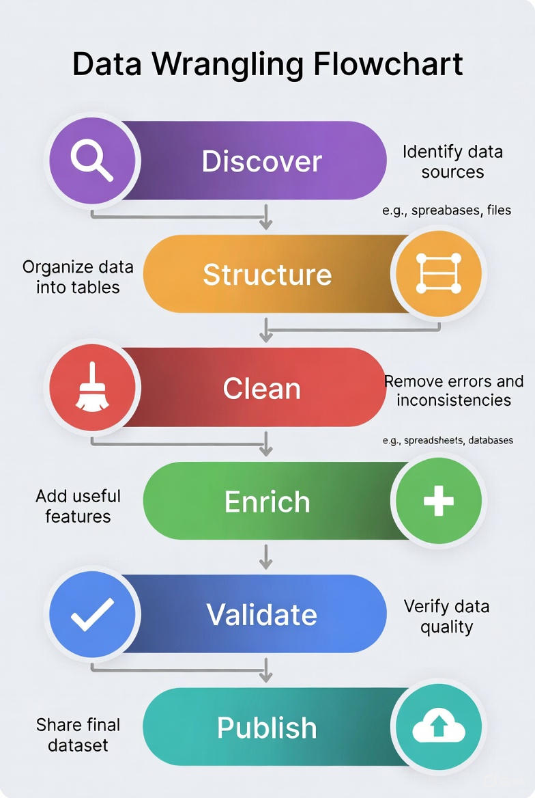
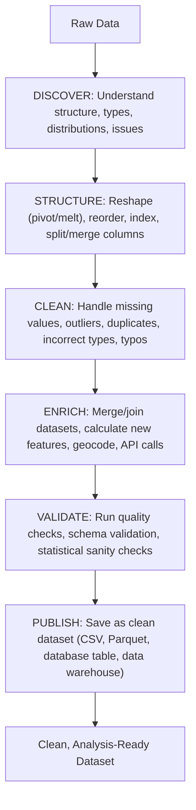

# Guest Lecture - Fundamentals of Quantitative Thinking

By Andrew Antaya

## Overview

In this two-part workshop, we will be learning how to perform data wrangling on real-world messy data.

"Data Wrangling" is the process of transforming raw, unstructured, or inconsistent data into a clean, structured format that is suitable for analysis and modeling.

Data wrangling is a key aspect of the scientific process, and one that you must learn to master to take your messy data and turn them into interpretable results.

### Data Wrangling Flowchart

[^1]

### The 6 Steps of Data Wrangling

[^2]

## About This Workshop

The data provided in this workshop is filled with errors, and it will be your job to become "data sleuths" to identify the errors and fix them. The instructor will walk you through their approach to data wrangling and provide you with code snippets to get started.

Please note that the data provided in this workshop is simulated data (i.e., not real) and does not come from actual research. Take care not to interpret the findings of this workshop as scientifically valid results.

## Learning Objectives

- Inspect real-world messy data
- Identify what needs to be fixed
- Join multiple data sets
- Use simple statistics to interpret data

## Footnotes

[^1]: Generated by Grok AI - verified by author for accuracy of information.
[^2]: Initially generated by Grok AI and reformated as mermaid diagram. Verified by author for accuracy of information.
